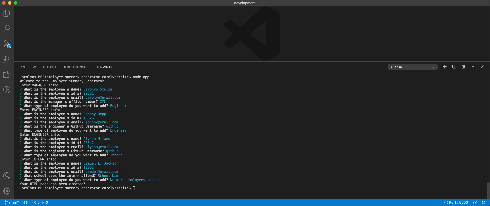
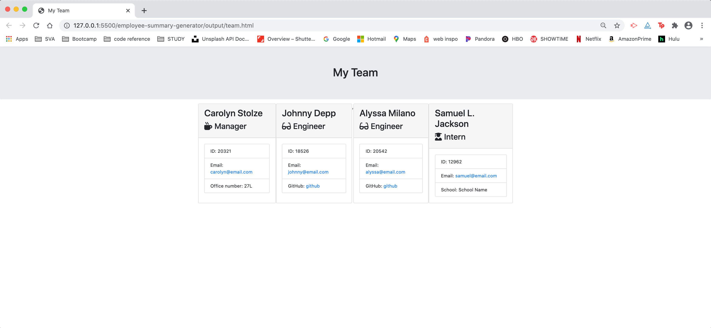

  

  <!--  -->
  # Employee Summary Generator 
  
<!-- Badges: MAY NEED TO ADJUST LICENSE BADGE URL -->

 
 
  
  - - -
  - - -
  ### Use this Node CLI to generate an HTML page with summaries of your employees.
  - - -
  - - -

  <!-- TOC -->
[Installation](#installation) // [How to Use](#how-to-use) // [Testing](#testing) // [Credits](#credits) // [License](#license) // [Questions & Feedback](#questions-feedback) 
  
## Installation
  
run command `npm i` to install dependencies

## How to Use 

run command `node app`

## Testing

run command `npm run test`

## Credits
  
[Inquirer](https://github.com/SBoudrias/Inquirer.js/) // NPM CLI for prompting questions  

<!-- License --> 
## License
    
The code is licensed under the [MIT](https://choosealicense.com/licenses/mit/) License.
  
  ## Questions & Feedback
  
  Have a question or feedback? Send me a note or just say hi, I'd be happy to hear from you!
  
  > “Knowledge is having the right answer. Intelligence is asking the right question.” ~ Unknown
  
  Email: carolyn@carolynmary.com  
  
  GitHub: [carolynmary](https://github.com/carolynmary)  
  
  Porfolio: [carolynmary.com](https://carolynmary.com) 
  
   
   

  
  © 2020 Carolyn Mary Stolze
  